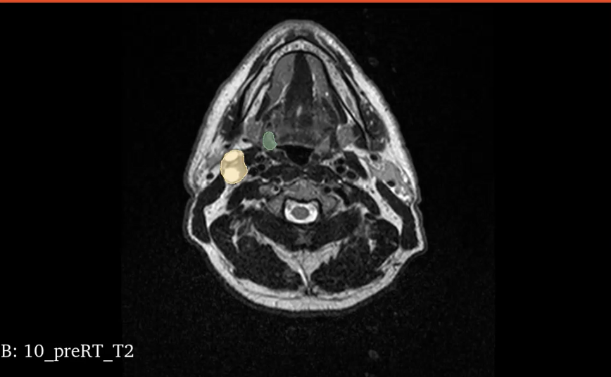
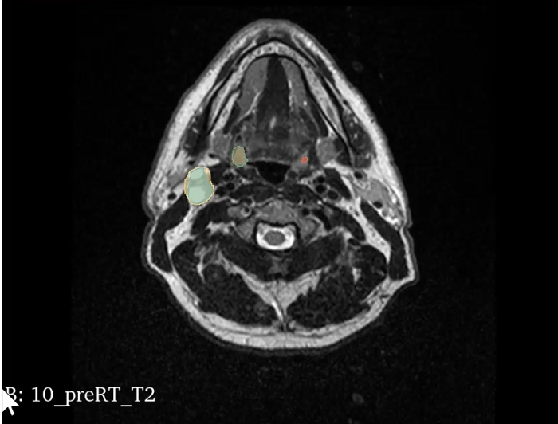
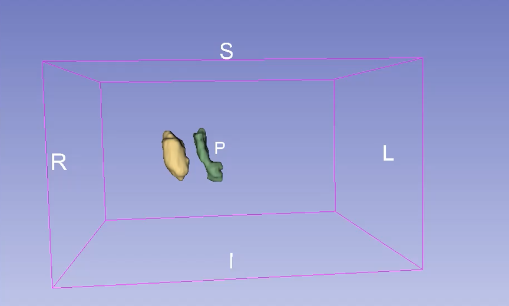
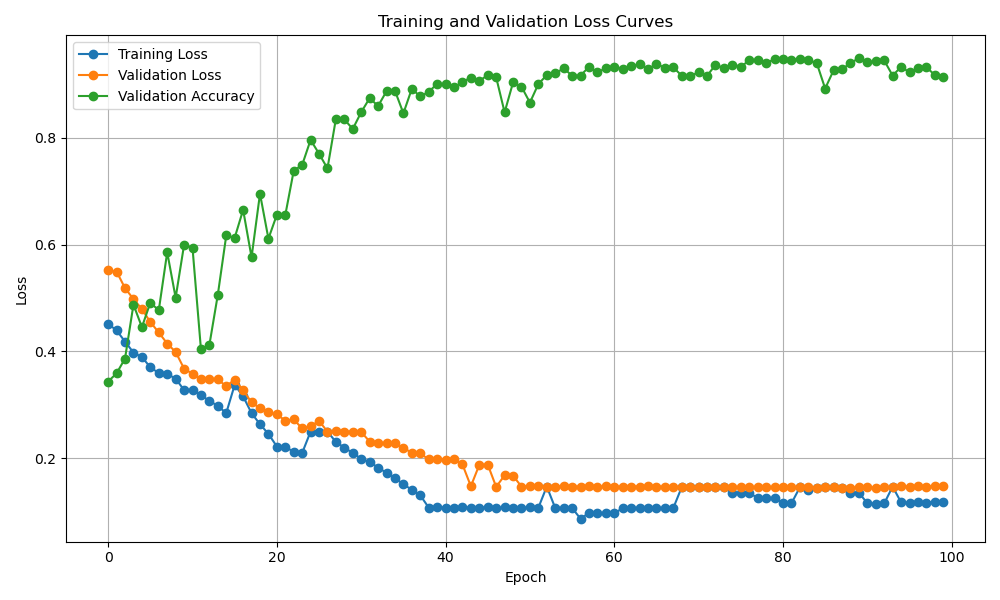

# U-Net MRI Segmentation (PyTorch)

This repository contains my work on **multi-class segmentation of head-and-neck tumor structures (HNTS-MRG dataset)** using a U-Net–style convolutional neural network in PyTorch.  
The project followed the **guidelines of the HNTS-MRG challenge**, but was developed independently.  

It demonstrates how deep learning can be applied to medical image segmentation, covering preprocessing, model training, evaluation, and inference.

---

## Features
- **Model**: 2D/3D U-Net architecture implemented in PyTorch  
- **Data**: [HNTS-MRG dataset](https://hn-mrg-challenge.github.io/) (NIfTI `.nii.gz` volumes with segmentation masks)  
- **Training**: Mixed-precision training with gradient scaling, configurable loss functions (CrossEntropy, Dice, or combination)  
- **Evaluation**: Dice coefficient and IoU per class, logging to console/JSON  
- **Inference**: Script for predicting tumor structures on new MRI volumes  

---

## Getting Started

### 1. Installation
```bash
# clone repository
git clone https://github.com/MariusLiebig/UNet-segmentation-MRI.git
cd UNet-segmentation-MRI

# create environment
python -m venv .venv && source .venv/bin/activate   # Windows: .venv\Scripts\activate
pip install -r requirements.txt
```
## Results

Below are example results from training and validation on the HNTS-MRG dataset using a U-Net:

### Example segmentation
Input MRI slice with ground-truth segmentation (Blue and Yellow) vs. model prediction (Red and Blue):  



### 3D reconstruction
Input MRI slice with ground-truth segmentation (Blue and Yellow) vs. model prediction (Red and Blue):  

 

Video of 3D reconstruction
  
▶ [Watch 3D rendering video](docs/0927.mp4)

### Training and validation curves
Loss and accuracy during training:  


**Summary**
- Validation Dice score: ~0.82 (baseline U-Net)  
- Inference time: ~1–2 seconds per 3D volume (RTX 3080)  


